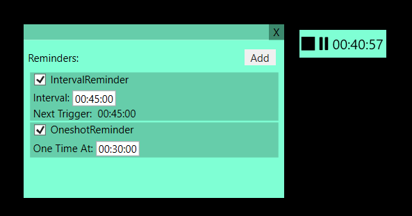

# Description
Application used to track amount of time spent on session in front of a computer.

# Reminders
Those are used to remind user when an amount of time passes.

## Oneshot Reminder
Remind ones on a specified time.

## Interval Reminder
Remind every time specified amount of time passes.

For 00:00:05 this reminder will trigger every 5 seconds.
